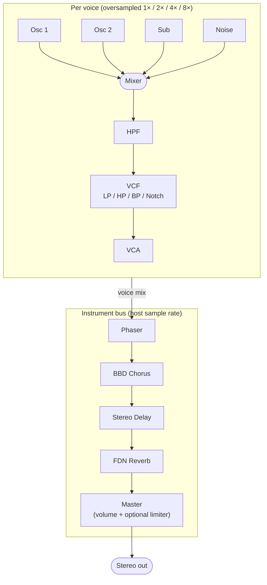

# Mental model

VXN1 is a classical subtractive synth with a few intentional deviations from the textbook layout. This page explains the signal path and modulation model in one pass.

## Signal path

- Per-voice path: oscillators → mixer → HPF → VCF → VCA. Runs at synthesis sample rate (optionally oversampled 1× / 2× / 4× / 8×).
- Instrument-level path (post voice-mix): phaser → BBD chorus → stereo delay → FDN reverb → master volume → limiter (optional).
- Voice rendering is **per-sample** (recurrences stay bit-faithful). Modulation runs at **control rate** — one update per 32-sample `CONTROL_BLOCK`.

## Two layers, always

VXN1 always carries **two complete patches** in memory — the **Upper** and **Lower** layers. Each layer has 8 channels. What MIDI does to those layers is governed by the [Key Mode](key-modes.md):

- **Whole**: 16-voice mono-timbral. Both layers play the same patch.
- **Dual**: 8 + 8 stereo layering. Both layers play different patches simultaneously on every note.
- **Split**: 8 + 8 split at a MIDI note. Below split → Lower; at-or-above split → Upper.

This is why some parameters are **per-layer** (everything in the oscillator / filter / envelope / LFO 1 / mod-route region) and some are **global** (master, LFO 2, all effects, oversampling).

## Modulation: fixed routes, not a matrix

VXN1 does not have a modulation matrix. Instead, every musically common destination is a dedicated panel with explicit source selectors and depths. The full set:

| Destination | Sources | Notes |
| --- | --- | --- |
| **Pitch** (both osc, vibrato) | LFO 1 / LFO 2 / Env 1 / Env 2 / Pitch Wheel | ±12 st on each route |
| **PWM** (Osc 1 + Osc 2 pulse width) | LFO 1 / LFO 2 / Env 1 / Env 2 / Mod Wheel | Fixed routes share both osc |
| **Filter Cutoff** | LFO 1 + LFO 2 + Env 1 + Velocity (four fixed depths) + Mod Wheel + Key Track | No source selector — all four depth knobs are live simultaneously |
| **Resonance** | Mod Wheel | Single fixed route |
| **Cross-Mod Sweep** (wide pitch) | Env 1 / Env 2 / Mod Wheel | ±48 st; only active when Cross-Mod Type ≠ Off |
| **VCA** | Env 2 (hardwired) + Amp LFO source selector + Tremolo depth | Env 2 always drives the VCA; Amp Gate bypasses to gate-only |

If a modulation idea isn't on a panel, VXN1 doesn't do it. This was a deliberate trade (ADR 0004): give up the matrix to gain a faceplate where every patch element is visible without diving into menus.

## Two envelopes, fixed roles

- **Env 1** is the **modulation envelope**. Default destinations: filter cutoff, pitch envelope, PWM envelope, cross-mod sweep. It is never wired to the VCA.
- **Env 2** is the **amplitude envelope**. Hardwired to the VCA. Can also drive pitch / PWM / cross-mod-sweep destinations, but its role at the VCA is non-negotiable (set Amp Gate to bypass Env 2 and have a gate-only amplitude).

Each envelope has a **Shape** parameter selecting linear or exponential segments. Env 1 defaults to linear; Env 2 defaults to exponential (smoother amplitude).

## Two LFOs, different scopes

- **LFO 1** is **per-voice**. Each voice has its own phase. By default it retriggers at note-on (set Free-Run on to have one continuous phase across all notes). Has delay/fade controls so vibrato or tremolo can ease in.
- **LFO 2** is **global**. One phase, shared by every voice in both layers. Useful for whole-instrument cycles where you want everything moving in lockstep.

Both LFOs can host-sync to tempo via the **Sync** toggle.

## Oversampling

The whole per-voice synthesis chain — oscillators, sub, noise, cross-mod, filter, drive saturation — runs at the oversampled rate. Effects (phaser, chorus, delay, reverb) run at the host sample rate. Higher oversampling reduces aliasing on sync, ring-mod, and resonant filter sweeps at CPU cost. Default is **2×** — adequate for most material; bump to 4× or 8× for aggressive sync leads or audible aliasing on bright patches.

## Voice allocation modes

Per layer (the [Voice & assign panel](panels/voice.md)):

| Mode | Behaviour |
| --- | --- |
| **Poly** | First-free voice, oldest-steal when full. Standard polyphonic behaviour. |
| **Unison** | All 8 channels stack on every note. Per-channel detune (`UnisonDetune`) and phase decorrelation. Mono — one note at a time. |
| **Solo** | One channel, last-note priority. Legato controls whether the envelope retriggers on a new note. |
| **Twin** | Two channels per note, ±`UnisonDetune` apart. Halves effective polyphony but doubles each note. |

Glide (`PortamentoTime`) is per-voice and applies in all modes.

With this in hand, the [faceplate reference](panels/overview.md) is mostly a walk through which knob does what within each box.
